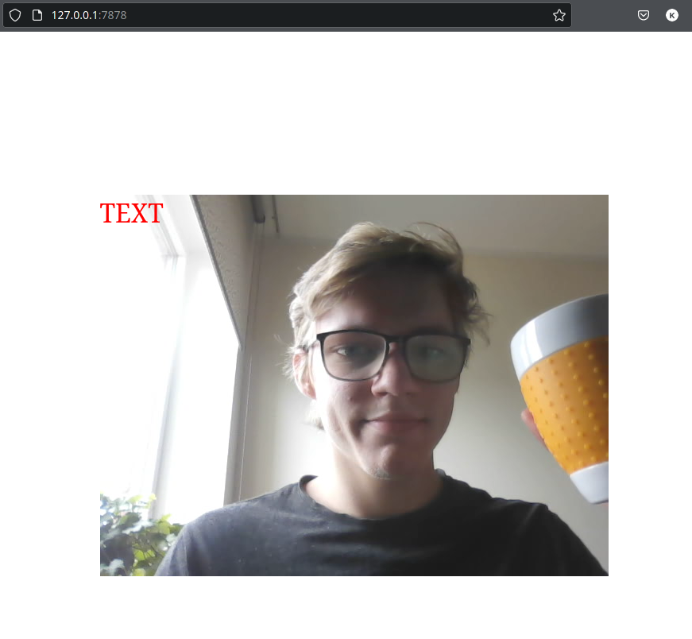
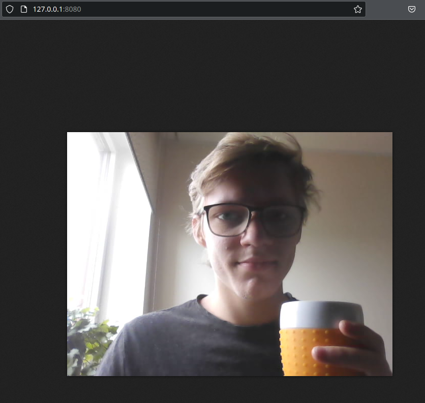

# Gst-Web-Overlay

## functionality
* Serves a single recording to a specific url link that then can be redirected to any web framework
* I used css grid to overlay any html element on top of the video feed

## CLI Options
* cargo run
* ./target/debug/gst-web-overlay

### Information
Program serves unedited feed to http **127.0.0.1::8080**
that is later passed on to **127.0.0.1::7878**
to use in pure html and css for flexability and modular approach

